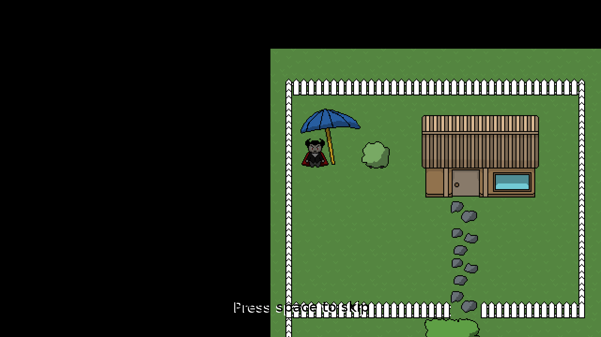
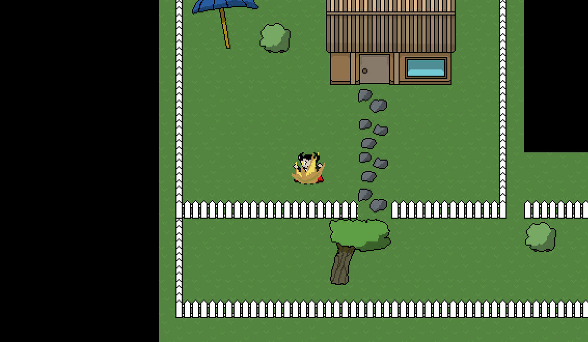
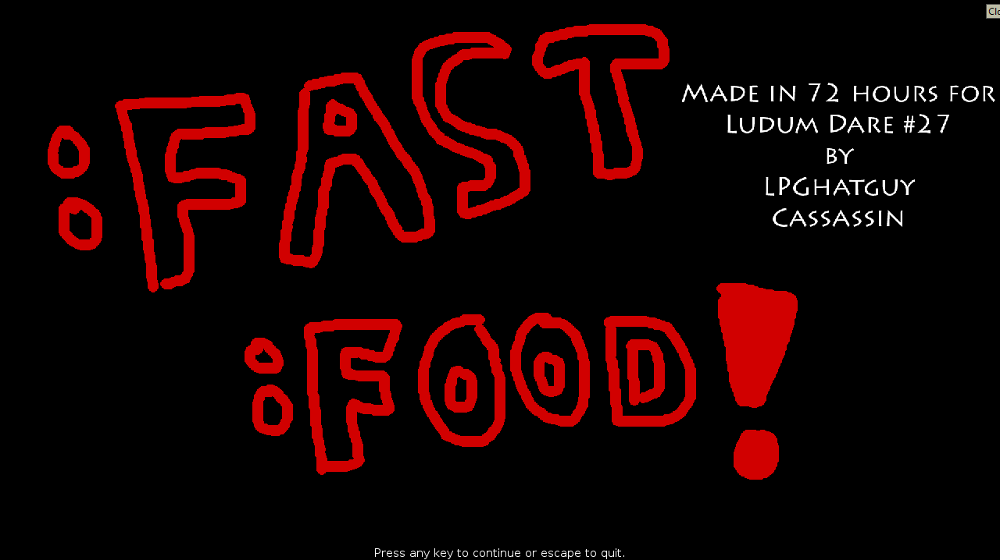

# [Ludum Dare 27: :Fast Food!](http://ludumdare.com/compo/ludum-dare-27/?action=preview&uid=14296)
This was my wife and I's entry for the Ludum Dare 27 Jam, which took place August 23rd-26th 2013. The jam's theme was **10 Seconds**.

This game was built using [LÖVE](https://love2d.org/) 0.8.0.

Original submission description:

> :Fast :Food is a game about a lovely vampire, Vlad, who timed his blood drinking times poorly and now finds himself thirsty in the middle of the day.
>
> Help Vlad brave the terror that is the sunlight by hiding under trees, umbrellas, and in bushes, while decimating the townsfolk. Beware, if they see you, it might be a dangerous chase after them.
>
> Use WASD to move and SPACE to attack.
>
> For platforms other than Windows, download LÖVE from love2d.org and use it to run the .love file.
>
> Full screen mode uses the largest resolution the game detects that your system supports, otherwise, the game will launch in a 1280x720 window.

Original submission screenshots:

## License
:Fast Food is available under the terms of the MIT license. See [LICENSE.txt](LICENSE.txt) or <https://opensource.org/licenses/MIT> for details.